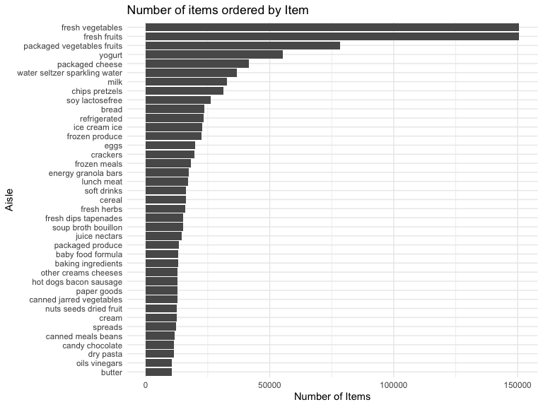
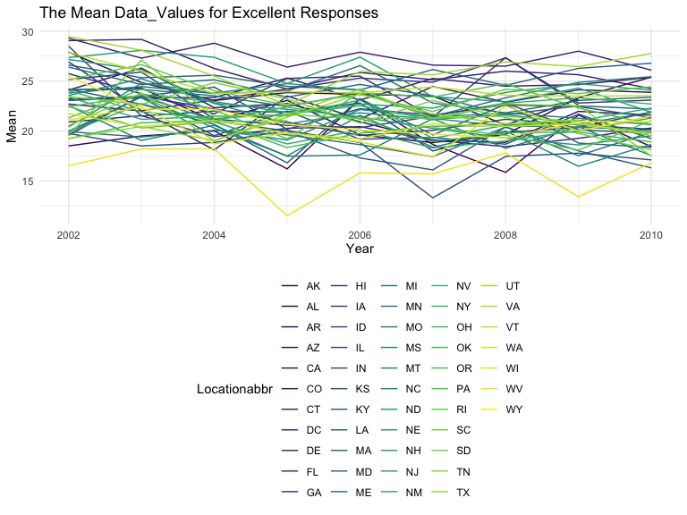
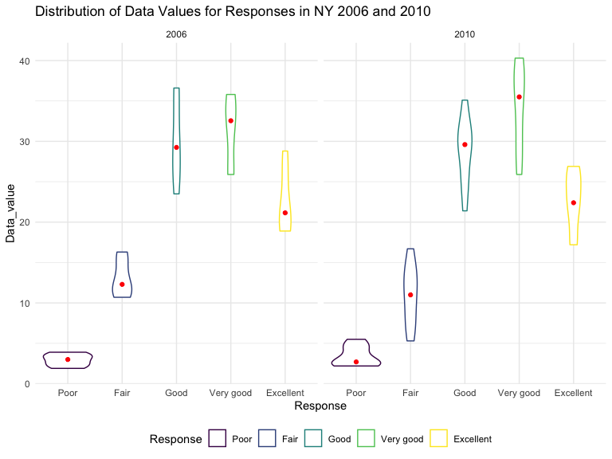
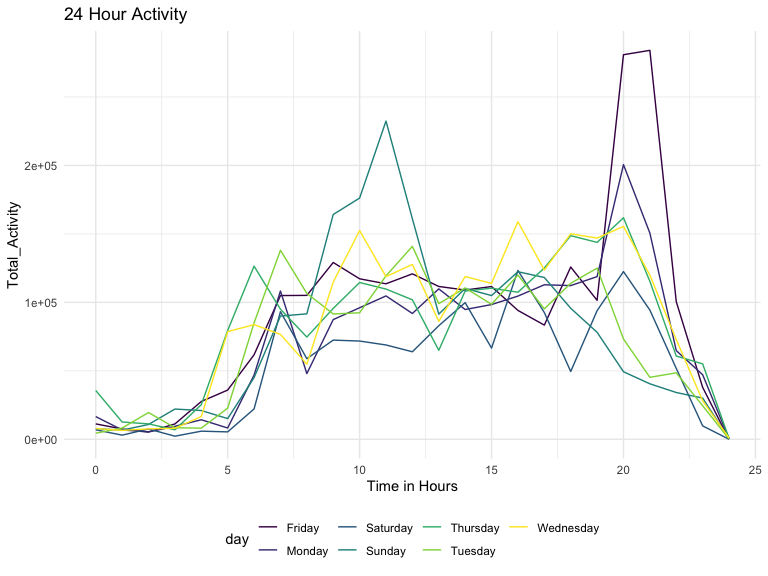

HW\_3
================
Arielle
10/10/2019

### First loading in the tidyverse and viridis library into my markdown page

### Problem 1

#### \* First I am loading the instacart dataset into r using the library datasets

``` r
library(p8105.datasets)
data("instacart")
 view (instacart)
```

The instacart data set has 1,384,617 obervations and 15 variabeles. The dataset includes the orderid and the product id as well as how many items are in the cart. The dataset also has information on whether or not the product was re-ordered previously or not, it also has information on the order number, the hour of the day the product was ordered and the name of the product. The aisleid and number as well as the deparment are also included in the dataset. Some of the key variables in the data set can be found below: order\_id: order identifier product\_id: product identifier add\_to\_cart\_order: order in which each product was added to cart reordered: 1 if this prodcut has been ordered by this user in the past, 0 otherwise user\_id: customer identifier eval\_set: which evaluation set this order belongs in (Note that the data for use in this class is exclusively from the “train” eval\_set) order\_number: the order sequence number for this user (1=first, n=nth) order\_dow: the day of the week on which the order was placed order\_hour\_of\_day: the hour of the day on which the order was placed days\_since\_prior\_order: days since the last order, capped at 30, NA if order\_number=1 product\_name: name of the product aisle\_id: aisle identifier department\_id: department identifier aisle: the name of the aisle department: the name of the department

#### \* How many aisles are there, and which aisles are the most items ordered from?

``` r
instacart %>% 
  count(aisle) %>% 
  arrange(desc(n))
```

    ## # A tibble: 134 x 2
    ##    aisle                              n
    ##    <chr>                          <int>
    ##  1 fresh vegetables              150609
    ##  2 fresh fruits                  150473
    ##  3 packaged vegetables fruits     78493
    ##  4 yogurt                         55240
    ##  5 packaged cheese                41699
    ##  6 water seltzer sparkling water  36617
    ##  7 milk                           32644
    ##  8 chips pretzels                 31269
    ##  9 soy lactosefree                26240
    ## 10 bread                          23635
    ## # … with 124 more rows

There are 134 aisles and the aisles with he most ordered items are from the fresh vegetables and fresh fruits.

#### \* Make a plot that shows the number of items ordered in each aisle, limiting this to aisles with more than 10000 items ordered. Arrange aisles sensibly, and organize your plot so others can read it.

``` r
instacart %>% 
  count (aisle) %>% 
  filter ( n > 10000) %>% 
  ggplot(aes(x = reorder(aisle,n), y=n)) +
  geom_bar (stat = "identity") + coord_flip() +
  labs(
    title = "Number of items ordered by Item",
    x = "Aisle",
    y = "Number of Items"
  )
```



Provided a graph that showed the number of items ordered by item.

#### \*Make a table showing the three most popular items in each of the aisles “baking ingredients”, “dog food care”, and “packaged vegetables fruits”. Include the number of times each item is ordered in your table.

``` r
instacart %>% 
  filter (aisle == c("baking ingredients", "dog food care", "packaged vegetables fruits")) %>%
  group_by (aisle, product_name) %>% 
  summarize(n = n()) %>% 
  filter (min_rank(desc(n)) < 4) %>% 
  knitr::kable (col.names = c("Aisle Name",
                              "Product Name",
                              "Item Count"))
```

| Aisle Name                 | Product Name                                    |  Item Count|
|:---------------------------|:------------------------------------------------|-----------:|
| baking ingredients         | Light Brown Sugar                               |         157|
| baking ingredients         | Organic Vanilla Extract                         |         122|
| baking ingredients         | Pure Baking Soda                                |         140|
| dog food care              | Organix Chicken & Brown Rice Recipe             |          13|
| dog food care              | Organix Grain Free Chicken & Vegetable Dog Food |          14|
| dog food care              | Original Dry Dog                                |           9|
| packaged vegetables fruits | Organic Baby Spinach                            |        3324|
| packaged vegetables fruits | Organic Blueberries                             |        1692|
| packaged vegetables fruits | Organic Raspberries                             |        1920|

Created a table that had the top three items in baking ingredients, dog food care and packages vegetables fruits in a nice table.

#### \* Make a table showing the mean hour of the day at which Pink Lady Apples and Coffee Ice Cream are ordered on each day of the week; format this table for human readers (i.e. produce a 2 x 7 table)

``` r
instacart %>% 
  filter (product_name %in% c("Pink Lady Apples", "Coffee Ice Cream")) %>% 
  group_by(product_name, order_dow) %>% 
  summarize (mean=mean(order_hour_of_day)) %>% 
  pivot_wider(
    names_from = "order_dow",
    values_from = "mean") %>% 
  knitr::kable(col.names= c("Product Name",
                            "Sunday",
                            "Monday",
                            "Tuesday",
                            "Wednesday",
                            "Thursday",
                            "Friday",
                            "Saturday"))
```

| Product Name     |    Sunday|    Monday|   Tuesday|  Wednesday|  Thursday|    Friday|  Saturday|
|:-----------------|---------:|---------:|---------:|----------:|---------:|---------:|---------:|
| Coffee Ice Cream |  13.77419|  14.31579|  15.38095|   15.31818|  15.21739|  12.26316|  13.83333|
| Pink Lady Apples |  13.44118|  11.36000|  11.70213|   14.25000|  11.55172|  12.78431|  11.93750|

Problem 2
---------

#### Loaded the BRFSS data into R using the class library name.

``` r
library(p8105.datasets)
data ("brfss_smart2010")
view (brfss_smart2010)
```

#### Cleaning the BRFSS data set.

``` r
brfss=
  brfss_smart2010 %>% 
 filter(Response %in% c("Excellent","Very good", "Good","Fair","Poor"))%>%
  mutate (Response = ordered(Response, c("Poor","Fair", "Good","Very good","Excellent")))
```

#### Cleaned the data set by focusing only on Overall Health as well as ordereing the data from Poor tp Excellent.

#### \* In 2002, which states were observed at 7 or more locations?

``` r
brfss %>% 
  filter (Year =="2002") %>% 
  group_by (Year,Locationabbr) %>% 
  summarize (n=n()) %>% 
  filter ( n> 6) %>% 
  knitr::kable (col.names = c("Year",
                              "State_Location",
                              "N"))
```

|  Year| State\_Location |    N|
|-----:|:----------------|----:|
|  2002| AZ              |   10|
|  2002| CO              |   20|
|  2002| CT              |   35|
|  2002| DE              |   15|
|  2002| FL              |   35|
|  2002| GA              |   15|
|  2002| HI              |   20|
|  2002| ID              |   10|
|  2002| IL              |   15|
|  2002| IN              |   10|
|  2002| KS              |   15|
|  2002| LA              |   15|
|  2002| MA              |   40|
|  2002| MD              |   30|
|  2002| ME              |   10|
|  2002| MI              |   20|
|  2002| MN              |   20|
|  2002| MO              |   10|
|  2002| NC              |   35|
|  2002| NE              |   15|
|  2002| NH              |   25|
|  2002| NJ              |   40|
|  2002| NV              |   10|
|  2002| NY              |   25|
|  2002| OH              |   20|
|  2002| OK              |   15|
|  2002| OR              |   15|
|  2002| PA              |   50|
|  2002| RI              |   20|
|  2002| SC              |   15|
|  2002| SD              |   10|
|  2002| TN              |   10|
|  2002| TX              |   10|
|  2002| UT              |   25|
|  2002| VT              |   15|
|  2002| WA              |   20|

The code above shows the states were observed at 7 or more locations in 2002. The table list out all the states that have more than 6 observations in it, 36 out of 50 states had more than 7 observation.

#### \* In 2010, which states were observed at 7 or more locations?

``` r
brfss %>% 
  filter (Year =="2010") %>% 
  group_by (Year,Locationabbr) %>% 
  summarize (n=n()) %>% 
  filter ( n> 6) %>% 
  knitr::kable (col.names = c("Year",
                              "State_Location",
                              "N"))
```

|  Year| State\_Location |    N|
|-----:|:----------------|----:|
|  2010| AL              |   15|
|  2010| AR              |   15|
|  2010| AZ              |   15|
|  2010| CA              |   60|
|  2010| CO              |   35|
|  2010| CT              |   25|
|  2010| DE              |   15|
|  2010| FL              |  205|
|  2010| GA              |   20|
|  2010| HI              |   20|
|  2010| IA              |   10|
|  2010| ID              |   30|
|  2010| IL              |   10|
|  2010| IN              |   15|
|  2010| KS              |   20|
|  2010| LA              |   25|
|  2010| MA              |   45|
|  2010| MD              |   60|
|  2010| ME              |   30|
|  2010| MI              |   20|
|  2010| MN              |   25|
|  2010| MO              |   15|
|  2010| MS              |   10|
|  2010| MT              |   15|
|  2010| NC              |   60|
|  2010| ND              |   15|
|  2010| NE              |   50|
|  2010| NH              |   25|
|  2010| NJ              |   95|
|  2010| NM              |   30|
|  2010| NV              |   10|
|  2010| NY              |   45|
|  2010| OH              |   40|
|  2010| OK              |   15|
|  2010| OR              |   20|
|  2010| PA              |   35|
|  2010| RI              |   25|
|  2010| SC              |   35|
|  2010| SD              |   10|
|  2010| TN              |   25|
|  2010| TX              |   80|
|  2010| UT              |   30|
|  2010| VT              |   30|
|  2010| WA              |   50|
|  2010| WY              |   10|

The code above shows the states were observed at 7 or more locations in 2010. The table list out all the states that have more than 6 observations in it, 45 out of 50 states had more than 7 observation.

#### \*Construct a dataset that is limited to Excellent responses, and contains, year, state, and a variable that averages the data\_value across locations within a state. Make a “spaghetti” plot of this average value over time within a state (that is, make a plot showing a line for each state across years – the geom\_line geometry and group aesthetic will help).

``` r
new_brfss=
  brfss %>% 
  filter (Response == "Excellent") %>% 
  group_by (Locationabbr,Year) %>% 
  summarize (mean= mean(Data_value)) 

new_brfss %>% 
ggplot (aes(x = Year, y = mean)) + geom_line(aes(group = Locationabbr, color = Locationabbr)) + labs(
  title= "The Mean Data_Values for Excellent Responses",
  x = "Year",
  y = "Mean")
```



Created a new dataset that focused only on the Excellent Responses in the BRFSS dataset.Created a varaible that represented the mean. The code for the ggplot that showd the mean distriburtion for each state that had Excellent Response is also present in the chunk.

#### \* Make a two-panel plot showing, for the years 2006, and 2010, distribution of data\_value for responses (“Poor” to “Excellent”) among locations in NY State

``` r
brfss %>% 
  filter (Year %in% c("2006", "2010"), Locationabbr == "NY") %>% 
  filter(Response %in% c("Excellent","Very good", "Good","Fair","Poor"))%>%
  mutate (Response = ordered(Response, c("Poor","Fair", "Good","Very good","Excellent"))) %>% 
    ggplot (aes(x = Response, y = Data_value)) + geom_violin(aes( color= Response)) + stat_summary(fun.y= median, geom = "point", color = "red") +labs(
    title = "Distribution of Data Values for Responses in NY 2006 and 2010",
    x = "Response",
    y = "Data_value") +
  facet_grid(~Year)
```



The two plots show the distribution of Data values for responnses in NY in 2006 and 2010. The red point shows the median value for each response category in the the violin plot.

Problem 3
---------

``` r
accel =
  read_csv(file="./data/accel_data.csv") %>% 
  janitor::clean_names () %>% 
  mutate(
    week_type = if_else(day %in% c("Saturday","Sunday"), "Weekend", "Weekday")) %>% 
  pivot_longer(
    activity_1:activity_1440,
    names_to = "Minute",
    names_prefix = "activity_",
    values_to = "Activity") %>% 
  mutate(week= as.integer(week),
         day= as.character(day),
         day_id = as.integer(day_id),
         week_type = as.character(week_type),
         Activity = as.numeric(Activity),
         Minute = as.numeric(Minute))
```

    ## Parsed with column specification:
    ## cols(
    ##   .default = col_double(),
    ##   day = col_character()
    ## )

    ## See spec(...) for full column specifications.

#### \* Traditional analyses of accelerometer data focus on the total activity over the day. Using your tidied dataset, aggregate accross minutes to create a total activity variable for each day, and create a table showing these totals. Are any trends apparent?

``` r
accel %>% 
  group_by (week, day) %>% 
  summarize (total_activity = sum(Activity)) %>% 
  knitr::kable (col.names = c("Week", "Day", "Total_Activity"))
```

|  Week| Day       |  Total\_Activity|
|-----:|:----------|----------------:|
|     1| Friday    |        480542.62|
|     1| Monday    |         78828.07|
|     1| Saturday  |        376254.00|
|     1| Sunday    |        631105.00|
|     1| Thursday  |        355923.64|
|     1| Tuesday   |        307094.24|
|     1| Wednesday |        340115.01|
|     2| Friday    |        568839.00|
|     2| Monday    |        295431.00|
|     2| Saturday  |        607175.00|
|     2| Sunday    |        422018.00|
|     2| Thursday  |        474048.00|
|     2| Tuesday   |        423245.00|
|     2| Wednesday |        440962.00|
|     3| Friday    |        467420.00|
|     3| Monday    |        685910.00|
|     3| Saturday  |        382928.00|
|     3| Sunday    |        467052.00|
|     3| Thursday  |        371230.00|
|     3| Tuesday   |        381507.00|
|     3| Wednesday |        468869.00|
|     4| Friday    |        154049.00|
|     4| Monday    |        409450.00|
|     4| Saturday  |          1440.00|
|     4| Sunday    |        260617.00|
|     4| Thursday  |        340291.00|
|     4| Tuesday   |        319568.00|
|     4| Wednesday |        434460.00|
|     5| Friday    |        620860.00|
|     5| Monday    |        389080.00|
|     5| Saturday  |          1440.00|
|     5| Sunday    |        138421.00|
|     5| Thursday  |        549658.00|
|     5| Tuesday   |        367824.00|
|     5| Wednesday |        445366.00|

The apparent trends that I notice in the table are that there are 5 weeks in the table. The weeks begin from Friday to Wednesday. There are no other apparent trends on the table. There are some days were activity is high and there are other days where the activity is low. There are two saturdays where the the activity was only 1440.00 these are the lowest points that are present on the table. Most of the activity was around 40,000 and 50,000.

#### \* Accelerometer data allows the inspection activity over the course of the day. Make a single-panel plot that shows the 24-hour activity time courses for each day and use color to indicate day of the week. Describe in words any patterns or conclusions you can make based on this graph.

``` r
accel %>% 
  mutate (Total_hour= Minute %/% 60) %>% 
  group_by(day, Total_hour) %>% 
  summarize (Total_activity = sum(Activity)) %>%
  ggplot (aes(x = Total_hour, y = Total_activity)) + geom_line (aes(color= day)) +labs(
    title = "24 Hour Activity ",
    x = "Time in Hours",
    y = "Total_Activity") 
```



Some of the patterns seen in the graph are in the first 5 to 6 hours of the day there is low activity, this then increases a little between hours 5-10. There is a decrease in activity between hour 10- 15 and that stays at a constant rate to about hour 20. There tends to be a spike in activity at=round hour 20 and activity goes back down between hour 20-24. Fridays and Thursday tend to be the most active days with the highest peaks in activity and Saturday tends to be the lowest day of activity.
